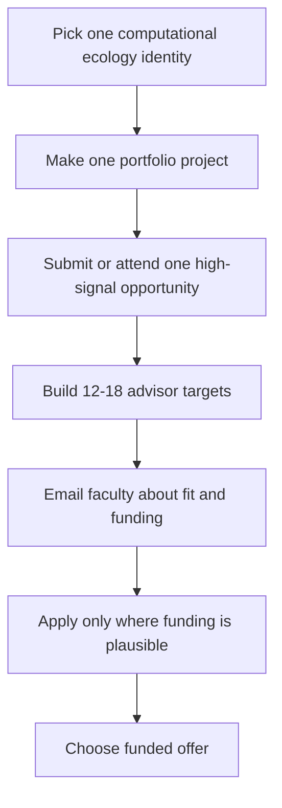

# Very Easy Guide to a Funded Computational Ecology PhD

Compiled on 2026-04-10. Goal: help a current master's student become a credible, funded PhD applicant in computational ecology.

## The Short Version

He should not try to do everything. He should do three things well:

1. Create one clear research identity: ecological question + computational method + data source.
2. Produce one visible artifact: poster, preprint, GitHub notebook, software contribution, or polished project page.
3. Apply only to labs/programs where funding is plausible: advisor RA, department TA/RA guarantee, or realistic fellowship route.

A strong one-sentence identity could be:

> I use Bayesian/statistical models and open ecological data to forecast how [species/ecosystem/process] changes across space and time.

## What Fully Funded Usually Means

For ecology PhD programs, a funded offer usually comes from one or more of these:

- RA funding: a professor has grant money and pays him to work on a research project.
- TA funding: the department funds him to teach while completing the PhD.
- Fellowship funding: external money such as NSF GRFP, DOE CSGF, NDSEG, university fellowships, or program-specific fellowships.

The rule: do not accept an unfunded research PhD unless there is an unusual reason. For every program, write down the funding model before applying.

## Funding Reality Check

| Funding path | Fit for him | What to check | Source |
|---|---|---|---|
| Advisor RA / department TA | Usually the most realistic path | Ask each potential advisor: Are you reviewing PhD students for Fall 2027, and do you anticipate RA/TA/fellowship funding? | Program/advisor websites |
| NSF GRFP | Potentially excellent, but eligibility is strict for current graduate students | NSF's FY 2026 solicitation says eligible categories include current first-year graduate students in their first graduate degree program with less than one academic year completed. Because he is already a master's student, he must verify eligibility before spending time on it. | [NSF GRFP solicitation](https://www.nsf.gov/funding/opportunities/grfp-nsf-graduate-research-fellowship-program/nsf25-547/solicitation) |
| DOE CSGF | Very strong if he does serious high-performance computing, modeling, AI, statistics, or computational science | DOE CSGF lists current master's students as eligible only if they enroll at a different institution for PhD studies by the fellowship start; it also requires full-time PhD study at a U.S. university. | [DOE CSGF eligibility](https://www.krellinst.org/csgf/about-doe-csgf/eligibility-program-requirements); [benefits](https://www.krellinst.org/csgf/about-doe-csgf/benefits-opportunities) |
| NDSEG | Fit-dependent; stronger if his work connects to supported STEM areas such as oceanography, remote sensing, computation, or defense-relevant environmental modeling | NDSEG is limited to U.S. citizens/nationals and doctoral study at a U.S. institution; check discipline fit carefully. | [NDSEG eligibility](https://ndseg.org/eligibility) |
| University fellowships | Worth checking for every target program | Look for first-year PhD fellowships, graduate school fellowships, diversity fellowships, and internal nominations. | Each university graduate school page |

## The Fastest High-Yield Plan



## Immediate Actions

| When | Action | Output |
|---|---|---|
| 2026-04-10 to 2026-04-15 | Decide whether to submit EFI, ECMTB, Evolution support, or System Dynamics scholarship materials. | One submission, or a documented decision to skip because fit/timing is wrong. |
| 2026-04-10 to 2026-04-28 | Register for the NEON Google Earth Engine webinar. | A NEON/GEE mini-project idea. |
| 2026-04-15 to 2026-06-14 | Apply to GRS/GRC if fit and budget make sense. | Application plus poster title/abstract. |
| May to June 2026 | Build a faculty list. | 12-18 advisors, each with 2 recent papers and funding notes. |
| June to August 2026 | Finish one portfolio project. | GitHub repo, one figure, 1-page project summary, 3-sentence pitch. |
| August to September 2026 | Email potential advisors. | 10-15 targeted emails asking about PhD openings and funding. |
| September to November 2026 | Draft applications. | CV, SOP, research statement, recommender packet. |
| October to December 2026 | Apply to funded-fit programs. | Final program list with funding model beside each program. |

## Highest-Impact Opportunities

| Opportunity | Use it for | CV line template | Cost/access note | Source |
|---|---|---|---|---|
| Evolution 2026 | This matters if his computational ecology story touches eco-evolutionary dynamics, population genetics, phylogenetics, or quantitative evolutionary ecology. | Participant/presenter, Evolution 2026, Cleveland, Ohio, 2026. Focus: evolutionary ecology and quantitative methods. | Official registration page lists graduate student in-person+virtual rates of USD 400 by 2026-04-15, USD 500 from 2026-04-16 to 2026-06-01, USD 550 after 2026-06-01; online-only student rate listed as USD 10. Low-cost virtual option; participation support available by application | [source](https://www.evolutionmeetings.org/registration.html) |
| Gordon Research Seminar: Unifying Ecology Across Scales | This matters because GRC/GRS participation signals serious research fit and gives him access to faculty who work on quantitative ecology at a high level. | Selected participant and poster presenter, Gordon Research Seminar: Unifying Ecology Across Scales, Stonehill College, 2026. | GRC page lists GRS conference fee USD 245, meals USD 250, lodging double occupancy USD 340 or private room USD 420. Not free; selective early-career format | [source](https://www.grc.org/unifying-ecology-across-scales-grs-conference/2026/) |
| Gordon Research Conference: Unifying Ecology Across Scales | This matters because GRC/GRS participation signals serious research fit and gives him access to faculty who work on quantitative ecology at a high level. | Participant, Gordon Research Conference: Unifying Ecology Across Scales, Stonehill College, 2026. | GRC page lists conference fee USD 950, meals USD 690, lodging double occupancy USD 620 or private room USD 840. Not free; application-based | [source](https://www.grc.org/unifying-ecology-across-scales-conference/2026/) |
| European Conference on Mathematical and Theoretical Biology 2026 (ECMTB) | This matters because it gives a direct mathematical biology signal, which is useful for theory-heavy computational ecology PhD programs. | Poster presenter, European Conference on Mathematical and Theoretical Biology, Graz, Austria, 2026. Poster: "[Modeling title]." | Early-bird regular student EUR 420; regular student EUR 520; SMB/ESMTB member student EUR 320 early or EUR 420 regular. PhD-student rates are higher. Participation grants available; not free by default | [source](https://ecmtb2026.org/how-to-register) |
| ESA Annual Meeting 2026 | ESA is the flagship U.S. ecology meeting and makes ecology-grad-school networking much easier. | Participant, ESA Annual Meeting 2026, [year]; focus: [one specific computational ecology skill or research output]. | Registration rates were not found on the official pages checked; confirm on ESA registration page before committing. Not free by default | [source](https://esa.org/saltlake2026/important-dates/) |
| Ecological Forecasting Initiative 2026 Conference | This matters because ecological forecasting labs want evidence that he understands prediction, uncertainty, data pipelines, and reproducible workflows. | Poster presenter, Ecological Forecasting Initiative Conference, Toronto, Canada, 2026. Poster: "[Forecasting question] with [model/data source]." | Registration not posted on the source page checked; travel scholarships available by application. Financial support available; not free by default | [source](https://ecoforecast.org/efi-2026-conference/) |

## Easy Wins and Low-Cost Signals

| Opportunity | Use it for | CV line template | Cost/access note | Source |
|---|---|---|---|---|
| NEON Data Skills Webinar: NEON Data in Google Earth Engine | This matters because NEON is a recognizable U.S. open ecological data source and makes a strong portfolio project possible without lab-specific data access. | Completed NEON Data Skills Webinar: NEON Data in Google Earth Engine, 2026; built reproducible Python/GEE workflow for [ecological dataset]. | No fee found on the NEON event page checked. Online; appears free/no fee listed | [source](https://www.neonscience.org/get-involved/events/data-skills-webinar-neon-data-google-earth-engine) |
| Ecological Forecasting Initiative Statistical Methods Seminar Series | This matters because ecological forecasting labs want evidence that he understands prediction, uncertainty, data pipelines, and reproducible workflows. | Participant, Ecological Forecasting Initiative Statistical Methods Seminar Series, 2026; focused on [method] for ecological forecasting. | No fee found on the source page checked. Online; appears free/no fee listed | [source](https://ecoforecast.org/workshops/statistical-methods-seminar-series/) |
| Data Carpentry Semester Biology Materials | This matters only if he turns the training into a public project; attendance alone is not enough. | Completed self-guided Data Carpentry biology data-analysis modules; created reproducible ecology analysis repository, 2026. | Free online materials. Free and online | [source](https://datacarpentry.github.io/semester-biology/materials/) |
| NEON Learning Hub Tutorials | This matters because NEON is a recognizable U.S. open ecological data source and makes a strong portfolio project possible without lab-specific data access. | Completed NEON open-data tutorials; built reproducible analysis of [NEON data product/ecosystem], 2026. | Free online tutorials. Free and online | [source](https://www.neonscience.org/resources/learning-hub/tutorials) |
| iDigBio Digital Data 2026 | Good fit for computational biodiversity, data integration, and informatics-oriented ecology applications. | Participant, iDigBio Digital Data 2026, [year]; focus: [one specific computational ecology skill or research output]. | Registration details were listed as coming soon; no cost posted on source page checked. Online; cost not yet posted | [source](https://www.idigbio.org/content/digital-data-2026) |
| posit::conf(2026) | This matters only if he turns the training into a public project; attendance alone is not enough. | Participant, posit::conf(2026), 2026; completed R/Python workflow training relevant to reproducible ecological analysis. | Academic students/educators: USD 1,298 all access, USD 749 conference-only, USD 549 workshops-only. Virtual students/educators: USD 98 all access, USD 49 conference-only, USD 49 workshops-only. Needs-based USD 0 conference-only option listed. Virtual student option; needs-based USD 0 conference-only option listed | [source](https://conf.posit.co/2026/pricing) |
| SciPy 2026 | This matters only if he turns the training into a public project; attendance alone is not enough. | Participant, SciPy 2026, Minneapolis, 2026; contributed to sprint/open-source workflow for scientific Python. | Student early-bird: USD 520 tutorials+conference, USD 275 tutorials-only, USD 275 conference-only. Student regular: USD 570 tutorials+conference, USD 335 tutorials-only, USD 335 conference-only. Sprints are free and open to everyone; 3.9% processing fee added at checkout. Free sprints; online tickets planned; financial aid exists but 2026 deadline passed | [source](https://ti.to/scipy/scipy2026) |
| Esri User Conference 2026 | This matters if he wants spatial ecology, remote sensing, or GIS-heavy labs; it should be paired with a map/model portfolio project. | Participant, Esri User Conference, San Diego, 2026; completed training in GIS/spatial analysis for ecological data. | Standard in-person USD 2,600; university student USD 150; digital access USD 99 or no cost for qualifying current Esri subscriptions/licenses; YPN USD 625 by 2026-05-29 then USD 1,275. Digital access can be no cost for qualifying users; student in-person rate is low-cost | [source](https://www.esri.com/en-us/about/events/uc/registration) |

## Watch-List Opportunities for the Next Cycle

| Opportunity | Use it for | CV line template | Cost/access note | Source |
|---|---|---|---|---|
| SPEC School | Selective, technical, ecology-specific training in remote-sensing data, which is highly relevant for computational ecology. | Selected participant, SPEC School, [year]; completed remote-sensing and spectral ecology training. | Program states it fully supports 15-20 U.S.-based participants per year; international participants need to fund travel into the U.S. Funded for selected U.S.-based participants; partially online | [source](https://www.specschool.org/) |
| BIOS2 Summer School: Biodiversity Modelling | Directly names biodiversity modeling, which maps well to computational ecology graduate applications. | Participant, BIOS2 Summer School in Biodiversity Modelling, [year]; completed graduate training in quantitative biodiversity models. | BIOS2 fellows have open access; guest scholarships may cover part of costs. Scholarships may be available; not free by default | [source](https://bios2.usherbrooke.ca/program/program-components/summer-schools/) |
| BIOS2 Summer School: Data-driven Ecological Synthesis | Purpose-built for data-driven ecological synthesis and graduate-level methods training. | Participant, BIOS2 Summer School: Data-driven Ecological Synthesis, [year]; focus: [one specific computational ecology skill or research output]. | BIOS2 fellows have open access; guest scholarships may cover part of costs. Scholarships may be available; not free by default | [source](https://bios2.usherbrooke.ca/program/program-components/summer-schools/) |
| CV4Ecology Workshop | Very strong computational-ecology signal if he wants machine learning, computer vision, or automated biodiversity monitoring. | Selected participant, CV4Ecology Workshop, [year]; trained in computer vision methods for ecological image data. | 2026 source listed USD 3,250 tuition for international students and attendee responsibility for travel to Washington, DC; some sponsorship may be possible. Not free by default; sponsorship may be possible | [source](https://cv4ecology.caltech.edu/call_for_applications.html) |
| ESIIL Innovation Summit 2026: AI for Sustainability | Strong AI/environmental-data signal and good regional opportunity if he is near Colorado. | Participant, ESIIL Innovation Summit 2026: AI for Sustainability, [year]; focus: [one specific computational ecology skill or research output]. | No registration fee for accepted participants; travel awards up to USD 1,200 available according to source. Free for accepted participants; travel awards available; some associated trainings virtual | [source](https://cu-esiil.github.io/Innovation-Summit-2026/) |
| Santa Fe Institute Complex Systems Summer School 2026 | Prestigious quantitative training, especially for theory-heavy or dynamical-systems ecology applications. | Participant, Santa Fe Institute Complex Systems Summer School 2026, [year]; focus: [one specific computational ecology skill or research output]. | Source lists USD 4,500 academic rate for 2026. Not free by default; check SFI for scholarships/fellowships | [source](https://www.santafe.edu/engage/learn/programs/complex-systems-summer-school) |

## How to Turn an Opportunity into an Application Advantage

Bad CV line:

> Attended ecology workshop.

Good CV line:

> Poster presenter, Ecological Forecasting Initiative Conference, 2026. Used Bayesian state-space models and NEON data to forecast [process] across [region].

Best version:

> Poster presenter, Ecological Forecasting Initiative Conference, 2026; built reproducible forecasting workflow in R/Python using NEON data; repository: [GitHub link].

## Faculty-Finding Workflow

For each faculty target, fill in this table before applying:

| Field | What to write |
|---|---|
| Faculty name | Name and title |
| University/program | Department and graduate program |
| Why this lab | One sentence connecting his project to their work |
| Methods match | Forecasting, Bayesian models, ML, GIS, remote sensing, population models, networks, HPC, etc. |
| Data/system match | NEON, camera traps, remote sensing, freshwater, forests, species interactions, disease, etc. |
| Funding clue | Lab hiring page, grant, RA posting, department guarantee, or direct email response |
| Two recent papers | Full citation or DOI for two papers he actually read |
| Email status | Not contacted / contacted / replied / meeting scheduled / not taking students |

Good email template:

```text
Subject: Prospective PhD student interested in computational ecology and [specific topic]

Dear Professor [Name],

I am a master's student working on [one-line project]. I am interested in PhD programs for Fall [year] and was excited by your recent work on [specific paper/topic], especially [specific detail].

My current direction is [ecological question] using [computational method/data]. I have experience with [R/Python/GIS/modeling skill] and am building [poster/GitHub/project].

Are you reviewing PhD students for Fall [year], and do you anticipate funding for a student working in this area?

Best,
[Name]
```

## Journals He Should Scan

This is not a claim about any one faculty member's publication record. It is a practical reading map for computational ecology.

| Journal | Why it matters |
|---|---|
| Methods in Ecology and Evolution | Methods, software, workflows, statistics, reproducibility. |
| Ecology Letters | High-impact ecology, often theory/data synthesis. |
| Ecological Applications | Applied modeling and decision-relevant ecology. |
| Theoretical Ecology | Mathematical and theoretical ecology. |
| Journal of Theoretical Biology | Broader mathematical biology and modeling. |
| Ecological Informatics | Computation, data, software, informatics. |
| Global Change Biology | Climate/global-change ecology and large datasets. |
| Remote Sensing of Environment | Remote sensing, spatial data, environmental monitoring. |
| Ecosphere / Ecology / Ecological Monographs | Core ecology venues to understand the field. |
| PNAS / Nature Ecology & Evolution | High-level examples of how strong ecology papers are framed. |

## What He Should Have Before Applications

- CV with one computational ecology project clearly visible.
- One GitHub repo or reproducible notebook that a professor can skim in 2 minutes.
- One figure showing he can turn ecological data into an interpretable result.
- One paragraph explaining the research identity: question, data, method, why it matters.
- 12-18 faculty targets, not just school names.
- Funding notes for every application.
- 2-3 letter writers who can speak to research ability, coding/quantitative skill, and independence.

## Decision Rule

If an opportunity does not create one of these outputs, skip it:

- Poster/presentation.
- Faculty conversation.
- Funding/scholarship application.
- Portfolio project.
- Concrete method skill tied to a research question.

The goal is not to collect activities. The goal is to make faculty believe: this student can join my lab, learn fast, analyze data, and finish a funded research project.
